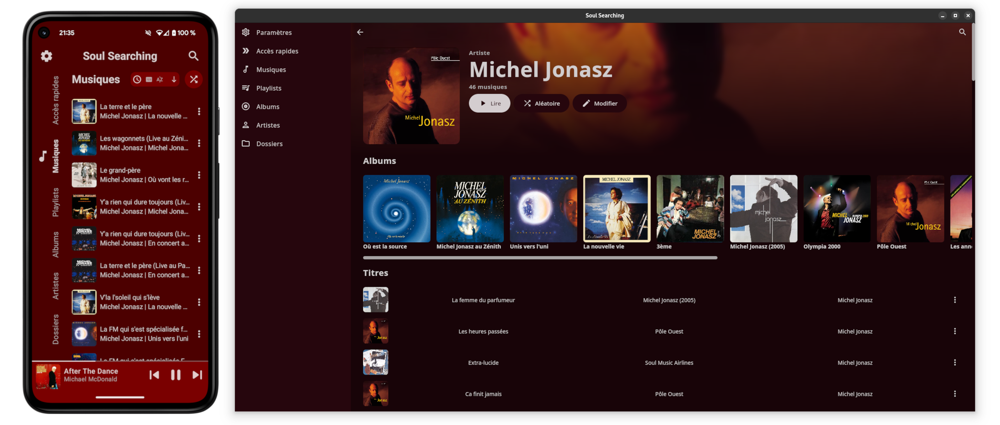
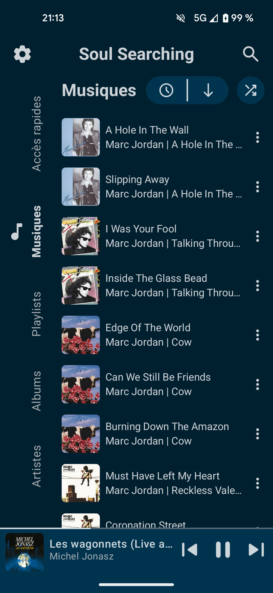
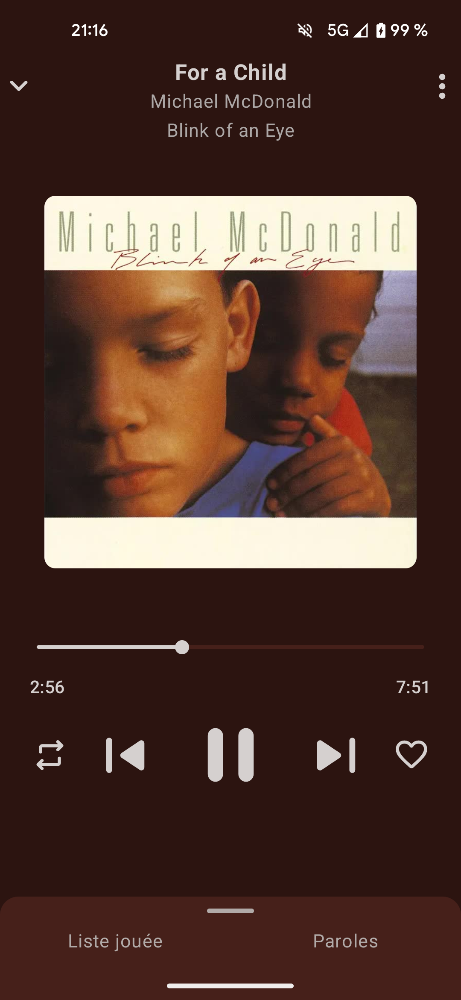
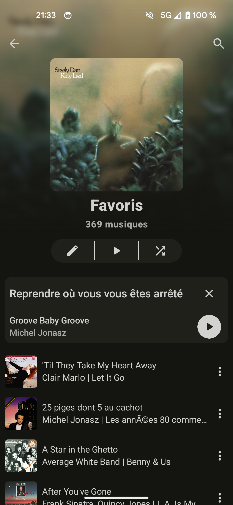
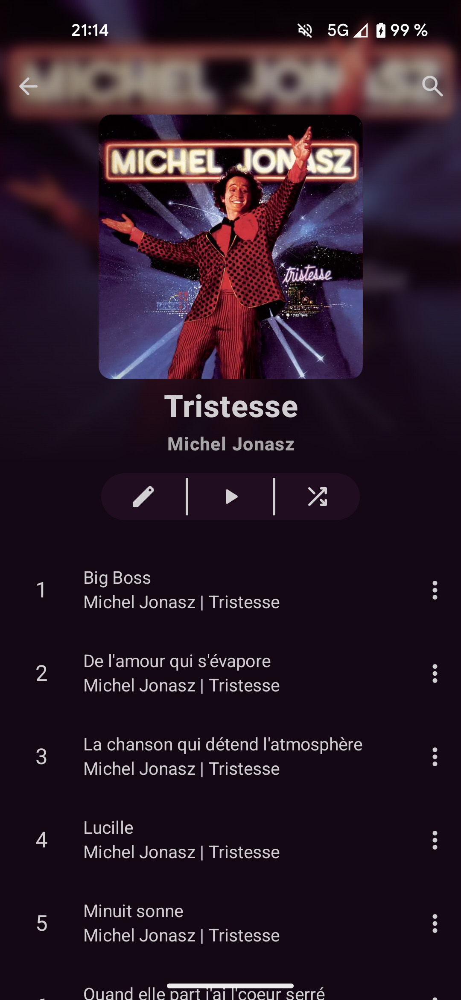
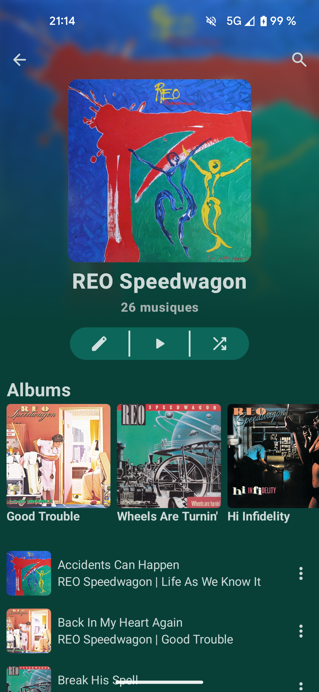
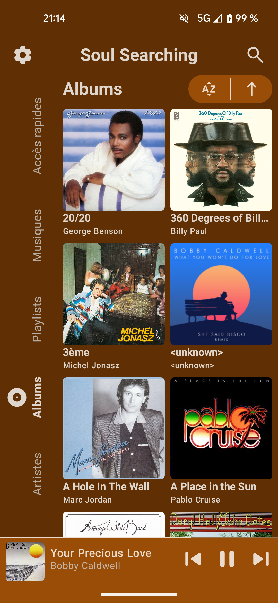
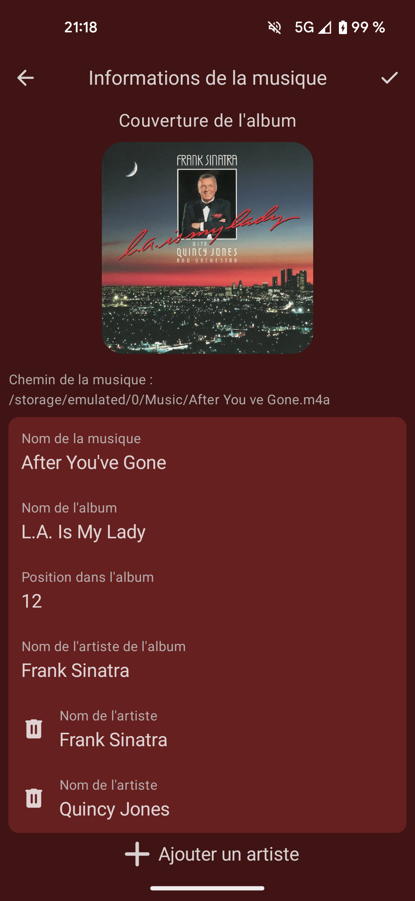
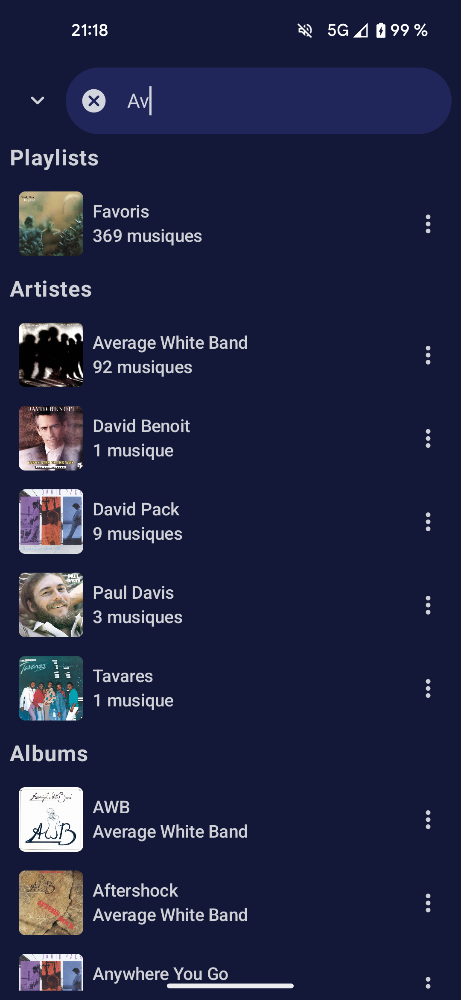
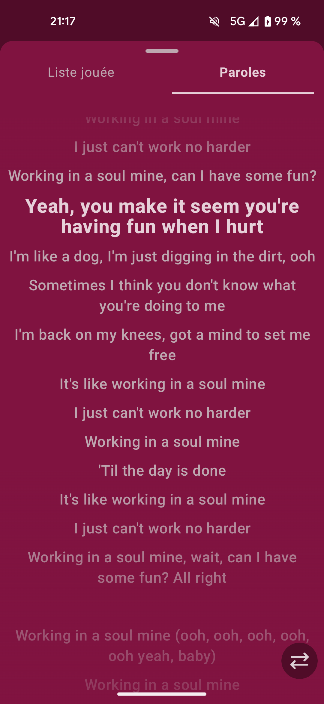

# Soul Searching

    

Soul Searching is a comprehensive, powerful, and customizable music app for listening to your local music on the following platforms:
- Android 8 and above
- Desktop (Linux)

Or download the latest APK from the [Releases Section](https://github.com/enteraname74/SoulSearching/releases/latest).

    

## General look

Soul Searching gives you multiple options regarding the color theme of the application.\
You can have a theme that depends on your system settings or the current music cover.

    
    
    
    
    
    

## Features

### A complete application:
- Playlist creation
- Support for **multiple played list**
- Played list management (play mode, adding, deleting, etc.)
- Playlist creation
- **Quick access** system
- Listening **statistics** (always stored locally only)
- **Synchronized lyrics** (from the audio file or an external source)
- Editing albums, artists, and songs (writing to audio file metadata)
- Support for **multiple artists** for the same song
- Search and sorting
- Folder management
- Adjusting the player volume

### A high-performance application:
- Supports a **large number** of music while remaining fluid
- Optimized logic for quickly performing complex tasks

### An application that reflects your style:
- Several default color themes
- Option to force a dark or light theme
- **Dynamic theme**, based on the album art color of the song being played
- Option to customize the application of the dynamic theme across all screens
- Choice of the seed used to generate the dynamic theme
- Customization of the player (swipe to change tracks, progress displayed in minimized mode, etc.)
- Home page customization (tab to open at startup, visible tabs, display style, etc.)

    
    
    

