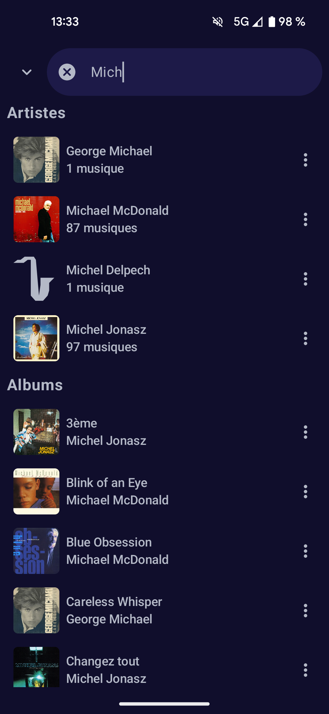
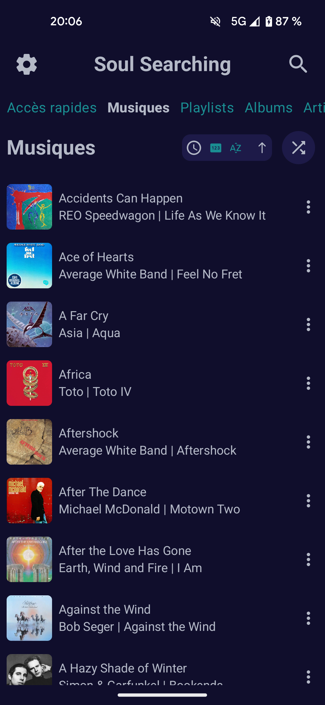

# Soul Searching

A rework of the native mobile application Sweet Music using Jetpack Compose. 

Soul Searching is an offline music application for Android 8 and above.

## Functionalities:

### I. General look:

Soul Searching gives you multiple options regarding the color theme of the application.

You can have a theme that depends on your system settings or the current music cover.

    
    
    
    
    

### II. Music related functionnalities:

- Listen all the songs on your device

- Multiple playing modes:
  
  - normal
  
  - shuffled
  
  - looped on one song

- Modify a song's name, artist, album

- Create and manage playlists

- Add an album, artist, playlist or even a song in a quick access

- Smart system for managing albums and musics without covers

- Manage current played music list

- Current played music list and current played music are saved between sessions

- Search throughout all your elements

- A music notification and an audio manager are used to improve the user's experience

    
    
    

### III. Settings:

    

Soul Searching provides multiple ways for customizing the application the way you want it to be.

#### Music management:

##### 1. Manage used folders:

You can manage used folders by choosing those you want to use for the application.

    

##### Add new songs:

You can search new songs to add from your device.

    

#### Color theme:

You can choose between three options:

**1. Dynamic theme:**

The color palette used for the application is based on the current played music.

    

**2. System theme:**

The color palette used for the application is based on the theme of your device (light or dark theme).

    
    
    

**3. Personalized theme:**

The default theme used is the system one, but you can choose to use a dynamic theme for the player view or for the playlist/album/artist view.

    

#### Customization:

Currently, you can customize the elements shown on the main screen.

Thus, you can choose what parts of the main page are shown (playlists, albums, artists, quick access).

You can also add a vertical bar that let you rapidly access elements on the main screen.

Examples of what you can achieve:

    
    
    

