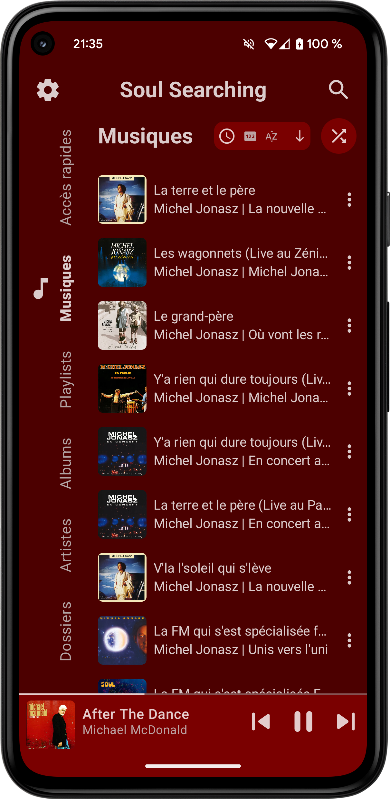
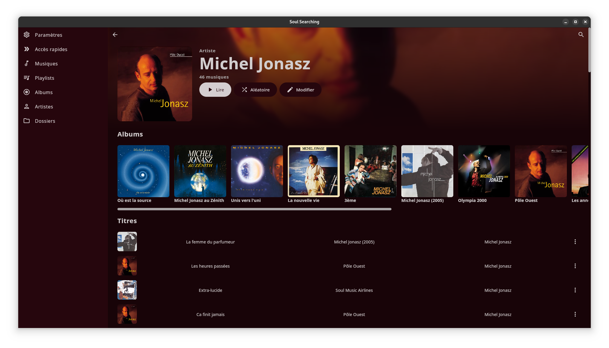

# Soul Searching

Soul Searching is an **offline music application** for the following platforms:
- Android 8 and above
- Desktop (Linux)

    
    

## Functionalities
### General look

Soul Searching gives you multiple options regarding the color theme of the application.

You can have a theme that depends on your system settings or the current music cover.

    
    
    
    
    
    

### Music related functionalities

- Listen all the songs on your device
- See **lyrics** of songs
- Multiple **playing modes**
- Modify songs, albums and artists on app and on the **device**
- Create and manage **playlists**
- Add an album, artist, playlist or even a song in **quick access**
- Smart system for managing albums and songs without covers
- Manage current played music list
- Current played music list and current played music are saved when closing the app
- Search throughout all your elements
- See songs by **added month** or **folders**
- A **music notification** and an **audio manager** are used to improve the user's experience
- See statistics about your most listened songs, artists...

    
    
    

### Settings

    

Soul Searching provides multiple ways for customizing the application the way you want it to be.

#### Music management
##### 1. Manage used folders

You can manage used folders by choosing those you want to use for the application.

    

##### 2. Add new songs:

You can search new songs to add from your device.

    

#### Color theme

You can choose between three options:

##### 1. Dynamic theme

The color palette used for the application is based on the current played music.

    

##### 2. System theme

The color palette used for the application is based on the theme of your device (light or dark theme).

    
    
    

##### 3. Personalized theme

The default theme used is the system one, but you can choose to use a dynamic theme for the player view, the playlist/album/artist view and for all the other views of the app.

    

#### Customization

Currently, you can customize the elements shown on the main screen.

Thus, you can choose what parts of the main page are shown (playlists, albums, artists, quick access).

Examples of what you can achieve:

    
    
    

