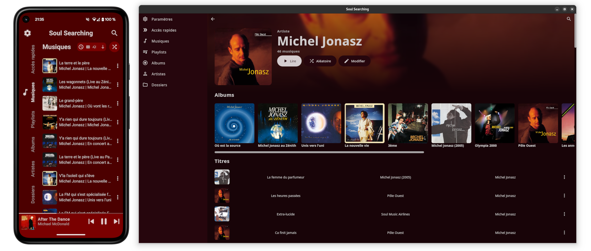
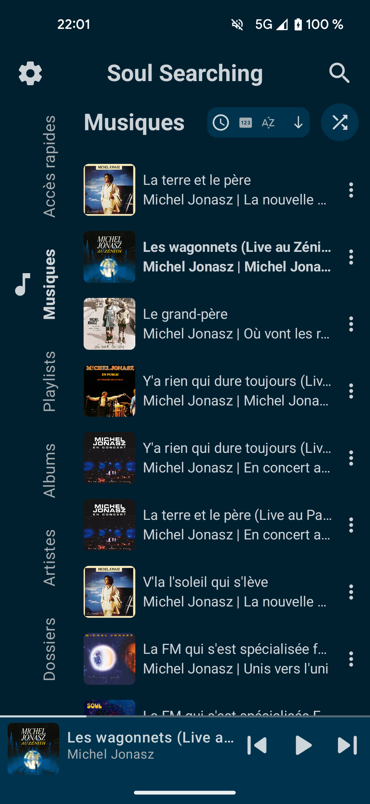
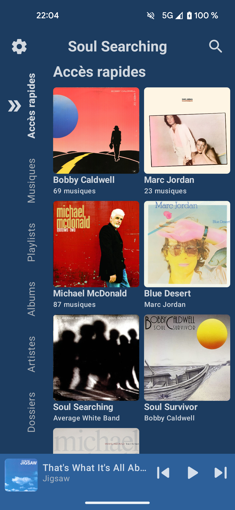
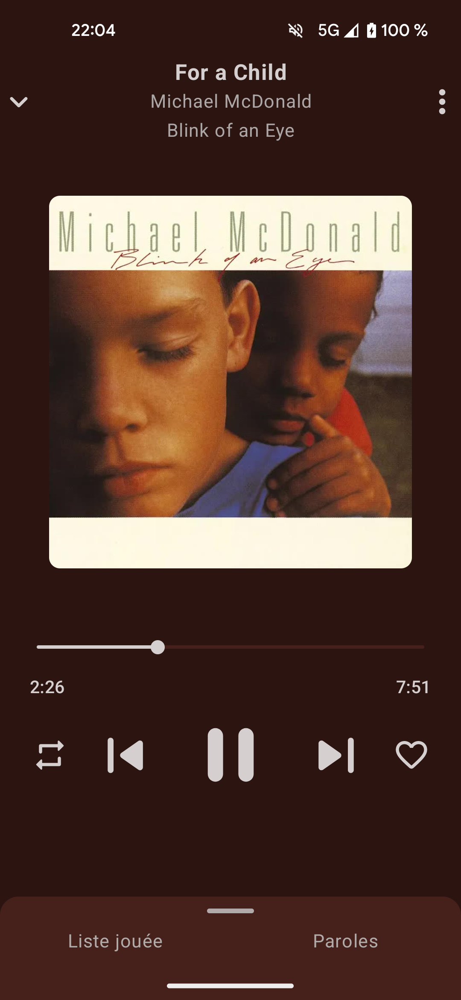
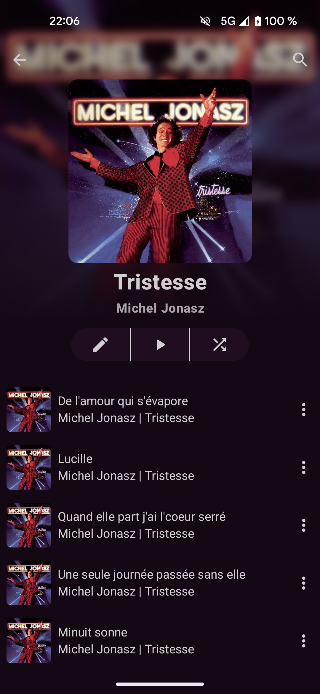
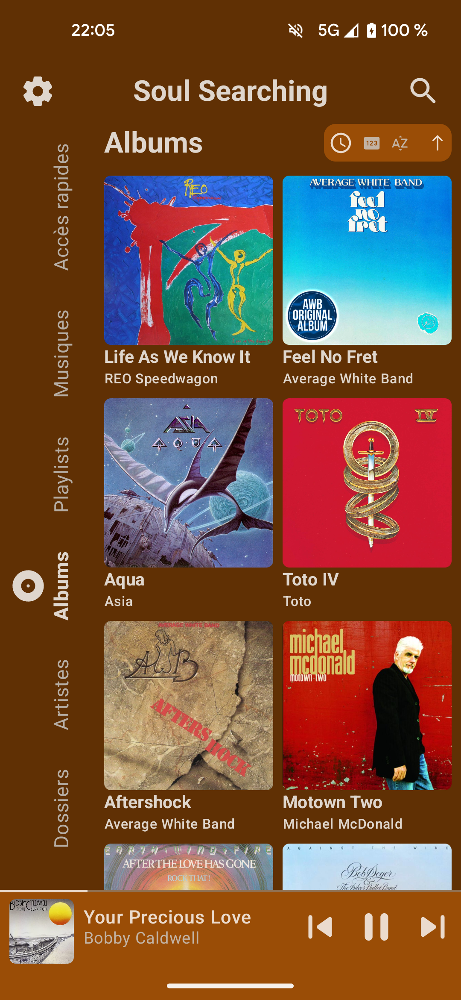
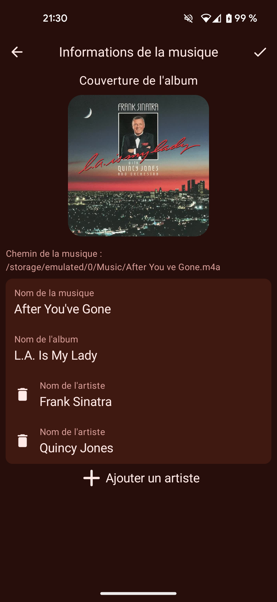

# Soul Searching

    

Soul Searching is an **offline music application** for the following platforms:
- Android 8 and above
- Desktop (Linux)

    

## General look

Soul Searching gives you multiple options regarding the color theme of the application.\
You can have a theme that depends on your system settings or the current music cover.

    
    
    
    
    
    

## Features

- Listen all the songs on your device
- See **lyrics** (classic and **synced**) of songs
- Customizable UI
- Multiple **playing modes**
- Modify songs, albums and artists on app and on the **device**
- Manage songs with multiple artists
- Create and manage **playlists**
- Add an album, artist, playlist or even a song in **quick access**
- Smart system for managing albums and songs without covers
- Manage current played music list with ease
- Search throughout all your elements
- See songs by **added month** or **folders**
- See statistics about your most listened songs, artists...

    
    
    
    

